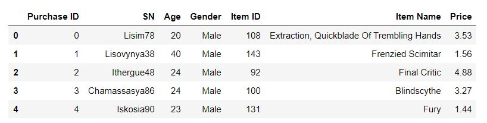

# pandas-challenge

Heroes of Pymoli

Heroes of Pymoli is a video game in which players can make purchases within the game as they advance through the levels. A dataset containing the items purchased by the players is provided. The challenge is to analyze the dataset to find different trends in purchasing behavior. 

1. I first printed out the first 5 rows of the dataset to understand the nature of the data
    
    Format: 
